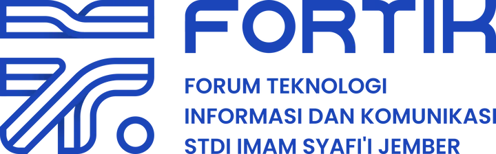

<p align="center">
  <a href="https://fortik.stdiis.ac.id/" target="_blank">
    
  </a>
</p>

<h1 align="center">PROJECT ARYA - WEBSITE FORTIK</h1>

<p align="center">
  Sebuah proyek yang dikerjakan oleh 3 anggota FORTIK untuk membuat sebuah website resmi UKM FORTIK STDIIS yang menjadi platform informasi dan dokumentasi pencapaian anggota.
</p>

---

## 💻 Tech Stack
Website ini dibangun menggunakan arsitektur modern (TALL Stack) dengan pertimbangan reaktivitas dan kemudahan manajemen:
- **Framework:** Laravel 12
- **Frontend/Reactivity:** Livewire 3.7 & Alpine.js
- **Styling:** Tailwind CSS
- **Admin Panel:** Filament PHP v4
- **Image Processing:** Intervention Image (Auto WebP Conversion)
- **UI Components:** Swiper JS (untuk slider dinamis)

---

## ⚠️ Peringatan Performa
Website ini sangat bergantung pada reaktivitas komponen Livewire yang menyimpan *state* secara dinamis. Untuk mencegah *I/O Bottleneck* yang mematikan CPU Server:

1. **DILARANG** menggunakan `database` sebagai `CACHE_STORE` atau `SESSION_DRIVER` di environment production.
2. **SANGAT DIREKOMENDASIKAN** menggunakan **REDIS**. Jika Redis tidak tersedia di server, gunakan `file` sebagai *fallback* terakhir.
3. Seluruh aset gambar dinamis akan otomatis dikompresi menjadi `.webp`. Pastikan server mendukung ekstensi `GD Library` atau `Imagick` pada PHP.

---

## 🚀 Panduan Instalasi (Production Deployment)

Ikuti langkah-langkah ini secara berurutan untuk menghindari *error* pada konfigurasi awal di server kampus.

### 1. Persiapan Repositori & Dependency

Clone repositori ke dalam server, lalu jalankan instalasi *dependency*. Pastikan menggunakan flag `--no-dev` untuk keamanan dan performa.
```bash
composer install --optimize-autoloader --no-dev
npm install
```

### 2. Konfigurasi Environment

Salin file `.env.example` kedalam file `.env` dengan menjalankan perintah berikut:
```bash
cp .env.example .env
```

Buka file `.env` dan sesuaikan variabel berikut:
```
APP_ENV=production
APP_DEBUG=false
APP_URL=https://fortik.stdiis.ac.id

# Konfigurasi Database
DB_CONNECTION=mysql
DB_HOST=127.0.0.1
DB_PORT=3306
DB_DATABASE=project_arya  # Ubah jika nama database di production berbeda
DB_USERNAME=root
DB_PASSWORD=

# KONFIGURASI CACHE & SESSION MUTLAK (Gunakan redis jika ada)
CACHE_STORE=redis
SESSION_DRIVER=redis
```

### 3. Generate Key & Storage Link

Generate kunci enkripsi aplikasi dan buat jembatan symlink agar file gambar yang diunggah admin dapat diakses secara publik.

```bash
php artisan key:generate
php artisan storage:link
```
### 4. Migrasi Database

Pastikan database `project_arya` (atau nama yang sesuai) sudah dibuat di DBMS server. Lalu eksekusi struktur tabel (seeder hanya dijalankan sekali saja di awal):

```bash
php artisan migrate --force --seed
```
### 5. Inisialisasi Database Shield (Role)
Jalankan perintah di bawah ini untuk generate role Shield di database
```bash
php artisan shield:generate --all
```

### 6. Kompilasi Aset Frontend

Bangun aset CSS dan JS statis untuk production:
```bash
npm run build
```

### 7. Optimasi Cache Laravel (Wajib)
Bekukan semua konfigurasi, rute, dan view ke dalam memory server agar aplikasi berjalan maksimal tanpa membaca ulang file berulang kali:

```bash
php artisan optimize:clear
php artisan optimize
php artisan view:cache
php artisan event:cache
```

### 👨‍💻 Tim Developer (Kontributor Utama)

- **[Iqbal Ramadani](https://github.com/IqbalRamadani)**
- **[Farhan Syifaul Umam](https://github.com/farhansyflu)**
- **[Muhammad Naufal Irfansyah](https://github.com/Nawfall-stack)** 

