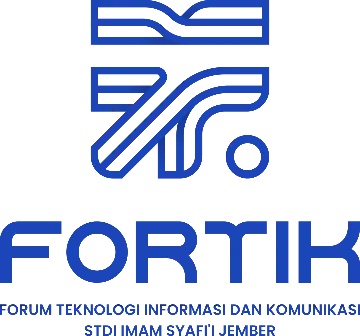

<p align="center">
  <a href="https://fortik.stdiis.ac.id/" target="_blank">
    
  </a>
</p>

<h1 align="center">Dokumentasi Kolaborasi FORTIK (Local Development)</h1>

Panduan ini dikhususkan untuk tim developer yang akan berkontribusi pada repositori web FORTIK. 
**PENTING:** Jangan pernah merubah file `composer.lock` atau `package-lock.json` tanpa koordinasi.

---

## 🛠 Panduan Setup Lokal (Herd & DBngin Workflow)

Ikuti langkah ini secara berurutan agar environment lokalmu tersinkronisasi sempurna dengan repositori utama.

### 1. Kloning Repositori

Lakukan fork repositori ini ke akun GitHub masing-masing, lalu clone ke folder lokalmu (sangat disarankan di dalam folder Herd).

```bash
git clone [https://github.com/](https://github.com/IqbalRamadani/website-fortik.git)
```

### 2. Install Dependency Sistem

- composer
```bash
composer install
```

- npm
```bash
npm install
``` 

### 3. Konfigurasi Environment Lokal

Salin file **.env.example** kedalam file **.env** dengan menjalankan perintah berikut:
```bash
cp .env.example .env
```
Lalu generate **App Key** dengan menjalankan perintah berikut:
```php
php artisan key:generate
```

### 4. Konfigurasi Database (DBngin)

1. Atur **database** ke **mysql** di file .env dan sesuaikan dengan konfigurasi masing-masing dengan catatan untuk nama db-nya **project_arya**

2. Jalankan **database** di **DBngin**

### 5. Migrasi & Storage Link

- Migrasi
```php
php artisan migrate
```

- Storage Link
```php
php artisan storage:link
```
### 6. Jalankan Server Development

Jalankan Vite untuk mengkompilasi aset Tailwind/Alpine secara real-time. Biarkan terminal ini menyala selama kamu ngoding.

```npm
npm run dev
```

### 👨‍💻 Tim Developer (Kontributor Utama)

- **[Iqbal Ramadani](https://github.com/IqbalRamadani)**
- **[Farhan Syifaul Umam](https://github.com/farhansyflu)**
- **[Muhammad Naufal Irfansyah](https://github.com/Nawfall-stack)** 

